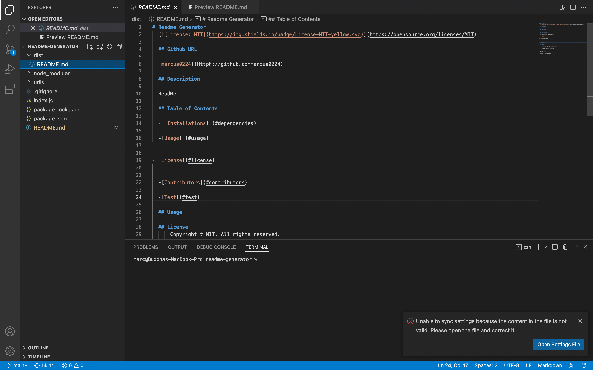
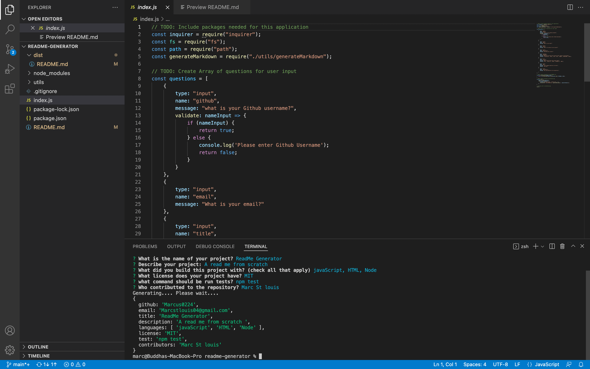
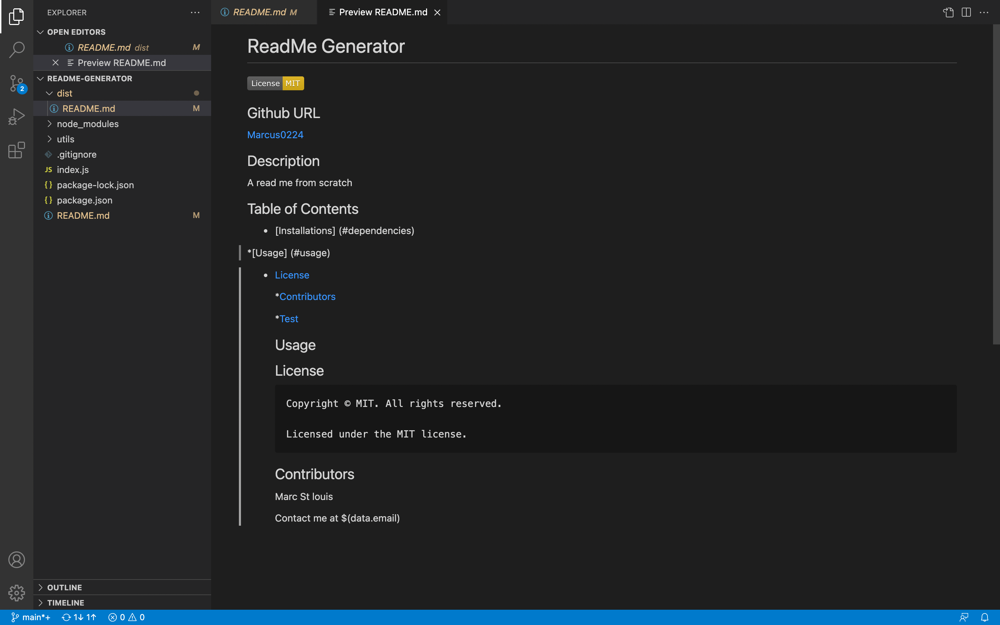

# Professional README Generator Starter Code

[How to create a Professional README](https://coding-boot-camp.github.io/full-stack/github/professional-readme-guide)

## Github URL
https://github.com/Marcus0224/readme-generator

## Walk through Video 
https://drive.google.com/file/d/1EQ_QgGJqWGR1KHL9Dy5ejrTpCvNSe1I9/view

## Description

It's a Node.js based tool where users can generate read me for their repo projects

## Table of Content

## Screenshots

